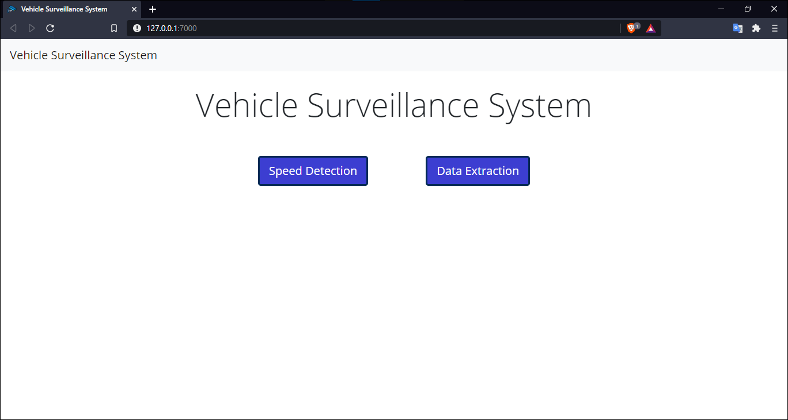
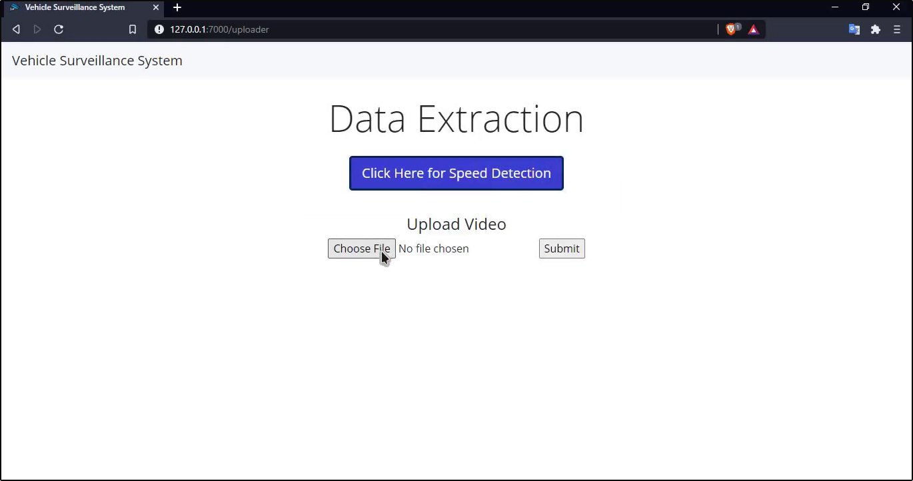
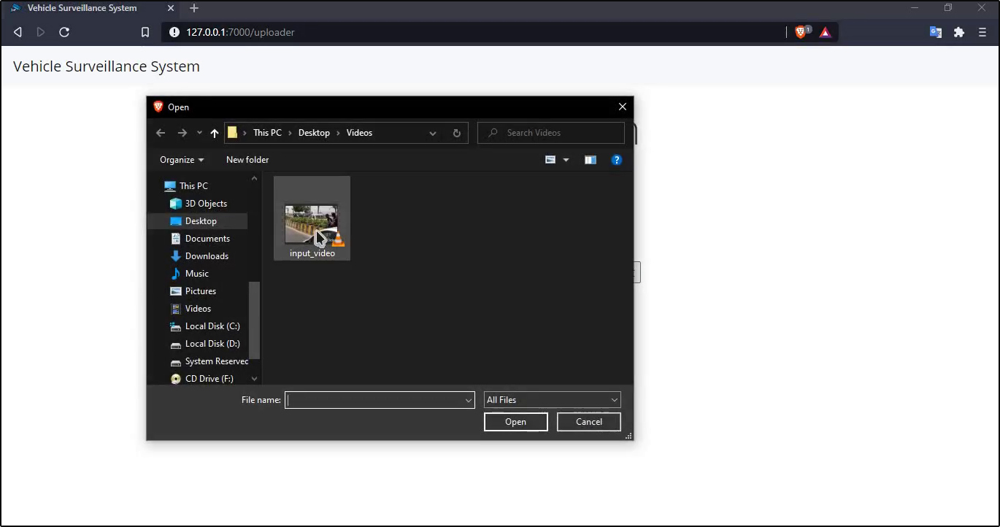
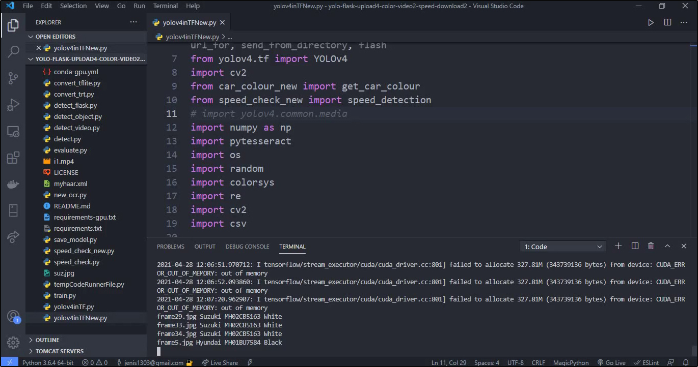
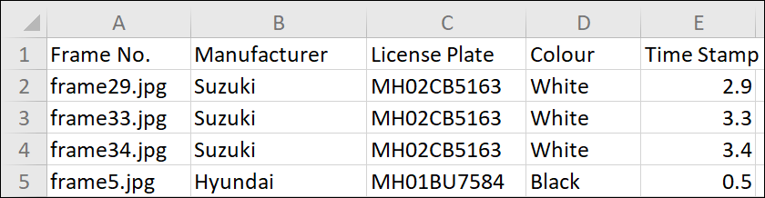
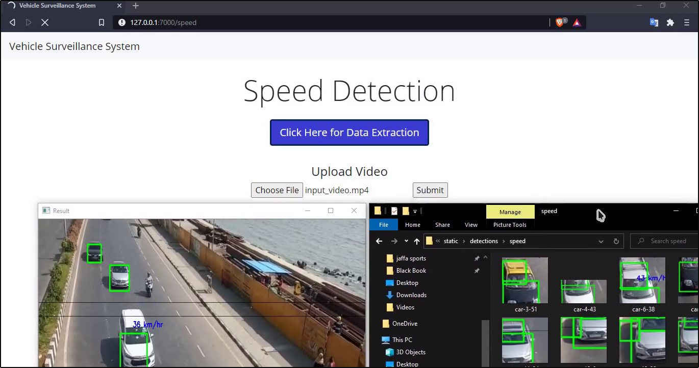
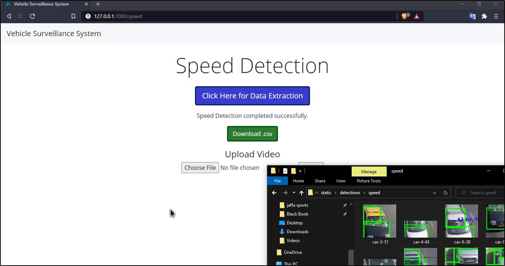
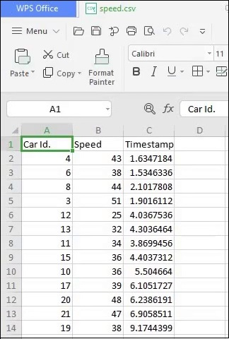

## Video Surveillance System

### Vehicle Identification and Speed Detection (VISD)

### Description:

VISD extracts vehicle information like License Plate number, Manufacturer and colour from a video and provides this data in the form of a CSV file. VISD can also perform vehicle speed detection on a video.
VISD extracts vehicle information by performing vehicle detection, license plate detection ,logo detection and color detection on frames extracted from the video. Vehicle Detection,license plate detection and logo detection are done using YOLOv4 and color detection is done using pixel method.
Another important feature of VSID is speed detection which is performed using Haarcascade Classifier.
All these features of VSID are provided to the user using a Web Application which is created using Flask (Screenshots included below).

### How To Run?

<strong>Download the required Weights File:</strong> 

 Pre-Trained YOLOv4 weights : https://drive.google.com/file/d/1OTVtOd3VvCPvw_IHGfINtzZt8OQx4ICn/view?usp=sharing

 License Plate YOLOv4 weights : https://drive.google.com/file/d/1HyLvb-fdGY0FrBxhNm1djGh2nrlNR0T7/view?usp=sharing

 Vehicle Logo YOLOv4 weights : https://drive.google.com/file/d/1nXoFgDE5qhG9DSocsLwm0cXeAPMmAy_o/view?usp=sharing

<strong>Paste all the weights file in /data folder.</strong>

<strong>Download the required python modules:</strong>
<ul>
  <li>cv2</li>
  <li>dlib</li>
  <li>Flask</li>
  <li>matplotlib</li>
  <li>numpy</li>
  <li>Pillow</li>
  <li>pytesseract</li>
  <li>tensorflow</li>
  <li>yolov4 (2.1.0)</li>
</ul>

<strong>Run the main.py file.</strong>
Visit 127.0.0.1:7000 on a Web-Browser to access the Web Application.
You can perform Vehicle Data Extraction or Speed Detection by clicking the desired option on the home page.

### Screenshots:

